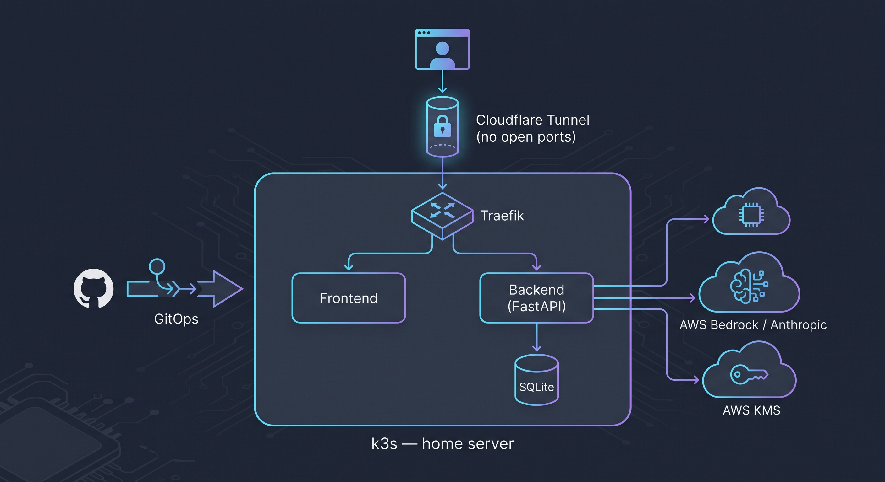
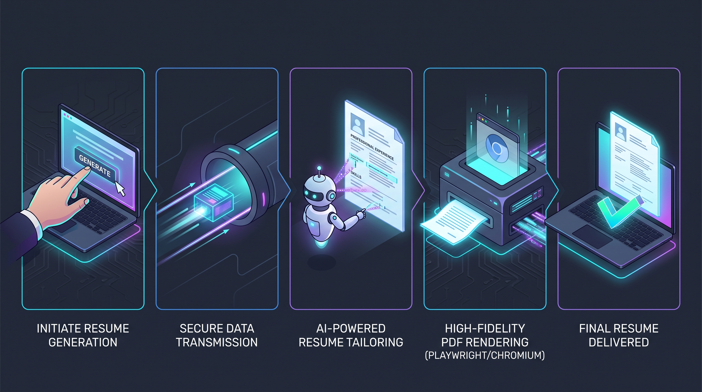
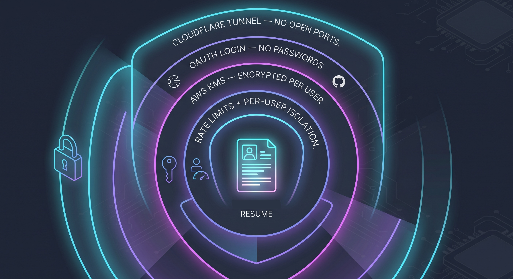
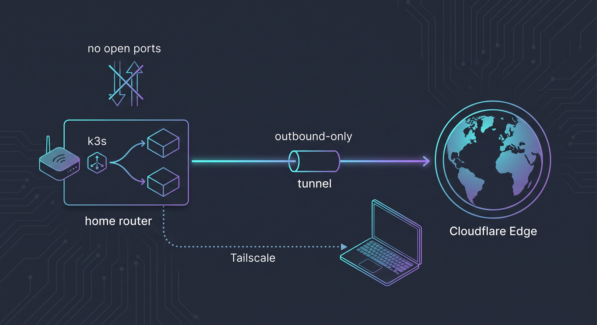

# Resume Builder

[](https://github.com/TomKoren1/resume_builder/actions/workflows/build-and-deploy.yml)
[](backend/requirements.txt)
[](backend/README.md)
[](helm/resume-builder/README.md)
[](argocd/README.md)
[](helm/resume-builder/README.md)
[](helm/resume-builder/README.md)

An AI-powered resume tailoring app: given a master resume and a target job
posting, an LLM selects and emphasizes the most relevant experience and
renders the result to a polished, single-page PDF. It's a genuinely public,
multi-user web app — anyone can sign in with Google or GitHub (no passwords
ever stored) and bring their own Anthropic API key (BYOK), so generations
are billed to each user's own key, never a shared one. It runs as a small
web app (FastAPI + a static frontend) self-hosted on a personal Kubernetes
cluster, exposed publicly through a Cloudflare Tunnel (outbound-only — no
inbound port is ever opened on the home network), with a full GitOps
pipeline (push to `main` → CI builds the images → ArgoCD deploys them) and
an observability stack (Prometheus/Grafana/Loki, alerting to Slack).

An earlier, simpler form of this project — tailor via a GitHub Actions
workflow on every push to a job description file, no web app or cluster
involved — still exists and works; see [Standalone CLI pipeline](#standalone-cli-pipeline)
below.

## How the web app works



1. Sign in with Google or GitHub (`backend/auth.py`) and add your own
   Anthropic API key under Account — stored encrypted (AWS KMS, see
   [Per-user API key encryption](#per-user-api-key-encryption)), never
   returned to the browser.
2. The frontend posts a job description to `POST /generate`. The backend
   tailors *your* stored master resume against it, using AWS Bedrock first
   and falling back to the direct Anthropic API (with *your* key) on any
   AWS error — see [Bedrock fallback](#bedrock-fallback-anthropic-api) —
   renders the result to a PDF (Jinja2 + Playwright), and stores both in
   SQLite, scoped to your account.
3. The **History** tab lists every past attempt (rename, delete, or
   click **Edit** to open a Canva-style click-to-edit view of that exact
   resume — reorder/hide sections, add a custom section on the spot, tweak
   theme/color/photo, save or save-as-new). The **Edit Master Resume** tab
   is a structured form for the master resume itself, including
   user-defined custom sections, with save + rollback across versions and
   an "import from an old resume" auto-fill.



Every user's master resume, history, and encrypted API key are scoped to
their own account (`users` table, `user_id` on every row) — there's no
shared or global resume data anymore. `app/master_resume.json` is only
ever a *placeholder-data seed for a fresh deploy's schema/CLI pipeline*,
never auto-loaded into any real user's account; see
[`app/README.md`](app/README.md).

## Security



- **Network**: Cloudflare Tunnel only — the home router has no open
  inbound ports at all; the tunnel is an outbound-only connection.
- **Identity**: OAuth only (Google/GitHub), no passwords ever stored.
- **Per-user secrets**: each user's Anthropic API key is encrypted with
  AWS KMS, never returned to the client — see
  [Per-user API key encryption](#per-user-api-key-encryption).
- **Application**: every endpoint scoped to the requesting user
  (`user_id` on every query — no IDOR), rate limiting on
  `/generate`/`/master-resume/import`, and HTML output is properly
  escaped (a stored-XSS class of bug, found and fixed in the resume
  rendering path, since that HTML is also fed to a real headless
  Chromium server-side for PDF rendering).

## Per-user API key encryption

Each user's Anthropic API key is encrypted with **AWS KMS**
(`backend/auth.py`), not a static local key — see
[`infra/README.md`](infra/README.md) for the Terraform that provisions the
KMS key and the narrowly-scoped IAM user the backend pod uses to reach it.
That same IAM user/identity is also the one the pod calls Bedrock as
(see [Bedrock fallback](#bedrock-fallback-anthropic-api)) — one set of
long-lived credentials, two least-privilege policies attached to it.
Rows saved before this migration (a local Fernet key) are handled by a
fallback-and-lazy-migrate path: a decrypt that isn't valid KMS ciphertext
falls back to the old key and immediately re-encrypts that one row via KMS
— each user's key upgrades itself the next time they generate a resume, no
downtime or batch migration needed.

## Repository layout

| Path | Purpose |
|---|---|
| [`app/`](app/README.md) | Resume data shape and the shared PDF-rendering logic: the master resume schema/placeholder seed, the Jinja2 print template (5 themes), and `render_resume.py`. |
| [`backend/`](backend/README.md) | The FastAPI app — OAuth login, BYOK API key encryption (KMS), tailoring, PDF rendering, per-user history/master-resume editing/versioning, metrics/logging. |
| [`frontend/`](frontend/README.md) | The static single-page UI (no build step, native ES modules) — Generate / History (with a Canva-style click-to-edit view per resume) / Edit Master Resume / Account / Login. |
| [`helm/resume-builder/`](helm/resume-builder/README.md) | The Helm chart that deploys the whole thing to Kubernetes — app, Cloudflare Tunnel, and the vendored Prometheus/Grafana/Loki monitoring stack. |
| [`argocd/`](argocd/README.md) | ArgoCD's own config (the `Application` that auto-deploys the chart above, notification wiring) — separate from the app chart since ArgoCD is a cluster-level tool. |
| [`.github/workflows/`](.github/workflows/README.md) | CI: builds and pushes images on every `backend`/`frontend`/`app` change, and the original standalone PDF-generation workflow. |
| [`infra/`](infra/README.md) | Terraform for the AWS side — the CI pipeline's OIDC + IAM role, and the live backend's KMS key + IAM user for per-user API key encryption. |
| `resume_contact.py` | Merges the *project owner's* real contact info in for the standalone CLI pipeline only — never applied to any signed-up user's resume; see [Contact info](#contact-info) below. |
| `project_description.md` | Detailed build log / phase-by-phase project history. |

## Deployment architecture

```
push to main
     │
     ▼
GitHub Actions (.github/workflows/build-and-deploy.yml)
  builds the changed image(s) → pushes to ghcr.io → bumps the tag in
  helm/resume-builder/values.yaml → commits back to main
     │
     ▼
ArgoCD (in-cluster, polls the repo)
  detects the change → syncs the Helm chart → k3s applies it
     │
     ▼
k3s cluster
  frontend + backend (SQLite on a PVC) + cloudflared + Prometheus/Grafana/Loki/Alertmanager
  (alerts → Slack)
```

No manual `docker build`/`helm upgrade`/`kubectl` is part of normal
day-to-day work — see [`helm/resume-builder/README.md`](helm/resume-builder/README.md)
and [`argocd/README.md`](argocd/README.md) for how the pieces fit together,
and [`.github/workflows/README.md`](.github/workflows/README.md) for the CI
side.

### Networking



The home router has **no open inbound ports at all** — public traffic
reaches the cluster only via a `cloudflared` pod holding an
**outbound-only** connection to Cloudflare's edge (`helm/resume-builder/templates/cloudflared-deployment.yaml`),
which routes to the same in-cluster Traefik Ingress as everything else.
Private/admin access to the server itself goes over Tailscale instead —
a separate, independent path that also never needs an open port.

## Running the backend locally (without Kubernetes)

```bash
pip install -r backend/requirements.txt
playwright install chromium

uvicorn backend.main:app --reload --port 8000
```

Then open `frontend/index.html` directly, or serve `frontend/` with any
static file server — `fetch` calls use relative paths (`/generate`, etc.),
so the frontend needs to be reachable at the same origin as the backend
(that's what the Ingress does in the deployed cluster; locally, point
whatever's serving the frontend at `http://localhost:8000` or run both
behind a reverse proxy).

The SQLite DB defaults to `app/resume_builder.db` (gitignored) when
`DB_PATH` isn't set, so this works without a PVC. Logging in needs real
Google/GitHub OAuth app credentials and a couple of other env vars first
— see [`backend/README.md`](backend/README.md#running-locally) for the
full list.

## Contact info

`app/master_resume.json` is committed and meant to be safe to make public,
so it only ever holds placeholder email/phone. `resume_contact.py`'s
override (real email/phone merged in at runtime) is used **only by the
standalone CLI pipeline** — `backend/tailor_cli.py` and `app/render_resume.py`'s
CLI entry point, generating the *project owner's own* resume:

- **Local runs of the CLI pipeline:** copy
  `app/contact_info.local.json.example` to `app/contact_info.local.json`
  and fill in your real email/phone. That file is gitignored and never
  committed.
- **CI (the CLI pipeline only):** `RESUME_EMAIL`/`RESUME_PHONE` repo
  secrets.

**The deployed multi-user web app deliberately never applies this
override** — `render_resume()` defaults to `apply_contact_overrides=False`,
and only the CLI's own `__main__` entry point opts in. This was a real bug
found and fixed during a security review: the override used to also run on
every user's `/generate` call and every History-editor save, silently
replacing *their* contact info with the project owner's. Every signed-up
user's contact section now always reflects their own master resume, never
anyone else's.

Neither env var is required for the CLI pipeline — with no override
present, the placeholder values in `master_resume.json` are used as-is.
LinkedIn/GitHub handles are left as real values directly in
`master_resume.json`, since a resume is meant to surface those (unlike a
phone number, they're not something you'd want to keep off a public copy).

## Bedrock fallback (Anthropic API)

Bedrock is billed to the app owner's AWS account, so **only one account
(`BEDROCK_ALLOWED_USER_ID`, default the owner's own user id, `1`) is
ever allowed to use it** — every other signed-up user's `/generate` call
skips Bedrock entirely and goes straight to the direct Anthropic API with
their own BYOK key (`backend/llm.py`'s `tailor_resume(..., use_bedrock=...)`,
gated in `backend/routers/generate.py`). This isn't a fallback-on-failure
distinction for other users; Bedrock is never attempted for them at all,
so their usage can never touch the owner's AWS bill.

For the allowed account, tailoring calls Bedrock first. The deployed
backend's AWS credentials (the `resume-builder-backend` IAM user, see
[Per-user API key encryption](#per-user-api-key-encryption)) are scoped to
exactly two things: KMS encrypt/decrypt on the one API-key-encryption key,
and `bedrock:InvokeModel` on the configured model. If that Bedrock call
raises a `boto3`/AWS error (throttling, a model not enabled in this
account/region, a real outage), it automatically retries the same
request against the direct Anthropic API instead — using **that same
user's own BYOK key** in the web app, or `ANTHROPIC_API_KEY` for the
standalone CLI pipeline:

- **Local runs / CI:** `ANTHROPIC_API_KEY` environment variable / repo secret.
- **The deployed web app:** each user's own key, decrypted just-in-time —
  see [Per-user API key encryption](#per-user-api-key-encryption). If
  Bedrock fails and the user has no key saved, `/generate` returns a clear
  400 telling them to add one under Account, rather than falling through
  to any shared/global key.

## Standalone CLI pipeline

Independent of the web app: `.github/workflows/generate-resume.yml` tailors
`app/master_resume.json` against `app/job_description.txt` and renders a PDF
on every push that changes the job description, uploading the PDF as a
workflow artifact — no server, cluster, or frontend involved. See
[`.github/workflows/README.md`](.github/workflows/README.md). Locally:

```bash
python backend/tailor_cli.py                                          # -> app/tailored_resume.json
python app/render_resume.py app/tailored_resume.json app/template.html app/output.pdf
```

## Infrastructure (AWS side: CI's Bedrock access + the web app's KMS key)

```bash
cd infra
cp terraform.tfvars.example terraform.tfvars   # fill in your AWS account ID
terraform init
terraform apply
```

See [`infra/README.md`](infra/README.md) for what this provisions (two
independent pieces — the CI pipeline's OIDC role, and the live web app's
KMS key + IAM user), why each is scoped the way it is, and an important
caveat about `-target` if you're applying just one piece against an
account/state that already has the other.

## Status

The web app, its Kubernetes deployment, the GitOps pipeline, OAuth/BYOK
multi-user auth, AWS KMS-backed per-user API key encryption, and the
monitoring stack are all live and verified end to end. See
`project_description.md` for the detailed phase-by-phase build history,
known issues, and open questions from earlier in the project.
